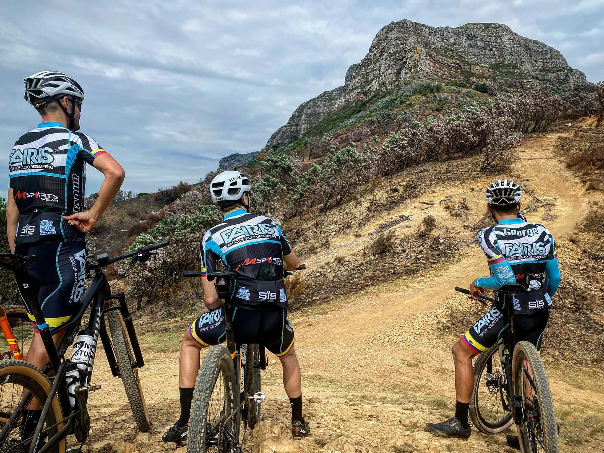

# BikeShopApp
[Click here to got to Heroku](https://vast-woodland-01889.herokuapp.com/)

As our project name suggest, Bicycle App shop is  an application that allows users to select bicycles by brand name, accessories, and service request. The user will have the ability to view the actual image of their selection along with the price and inventory in –stock associated  with each item.  This webpage contains fully functional forms for the users and members  to sign in, along with operational features that allow them to easily navigate , view options, make selections, and checkout successfully

[Click here to go to Bike App Site](https://github.com/chernanma/BikeShopApp)

### Table of Contents
- [Description](#description)
- [How to Use](#how-to-use)
- [Screenshots](#screenshots)
- [References](#references)
- [Author Info](#author-info)
---
## Description
User will be able to search for bicycle types, search for parts and accessories, and request repair services for bicycles. The app will also allow the owner and employee to perform the CRUD operations for the products, orders, employees, and customers 

##### Technologies

- Html
- jQuery
- node.js
- MySQL
- 3rd party framework
- Express
- Handlebars
- Css
- MVC model

Packages:
-Inquire.js
express.js
express-handlebars.js
mysql.js

   

#### Database Structure-

`

---
## How To Use
Complete the following steps in your local host:
	Clone the following repository in your computer 	 git@github.com chernanma/BikeShopApp.git.
Install all required packages:
	Run npm install in local terminal.
Run the App:
	node server.js in local terminal.

  

## Screenshots

-accessories

-Bikes

-Services

---
## License
Copyright (c) [2020] International Team

---
## Author Info
- Linkedin -- [Cesar Martinez](https://www.linkedin.com/in/cesar-martinez-3986b3120/)
- Linkedin -- [Adrian Storr](https://www.linkedin.com/in/adrian-storr-98773731)
- Linkedin -- [Amit Karmacharya](https://www.linkedin.com/in/amit-karmacharya-b344731ab/)
- Linkedin -- [Cesar A Martinez](https://www.linkedin.com/in/cesar-augusto-martinez-auquilla-03934a16b)

